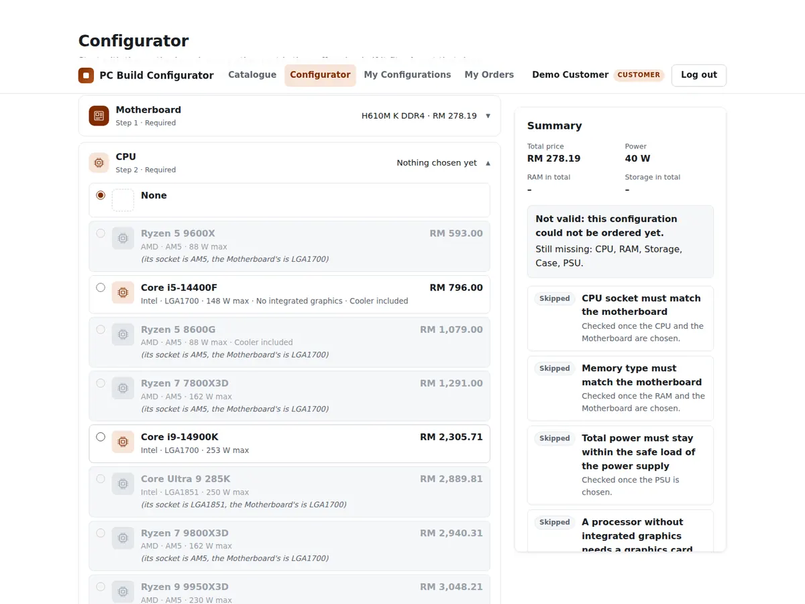
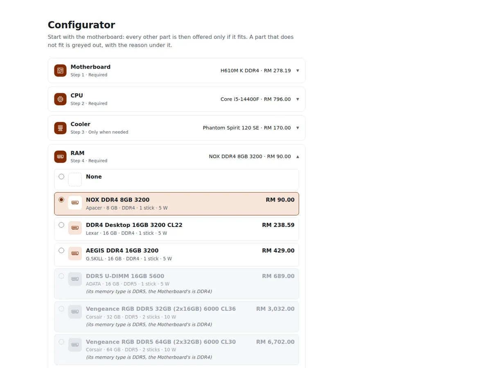
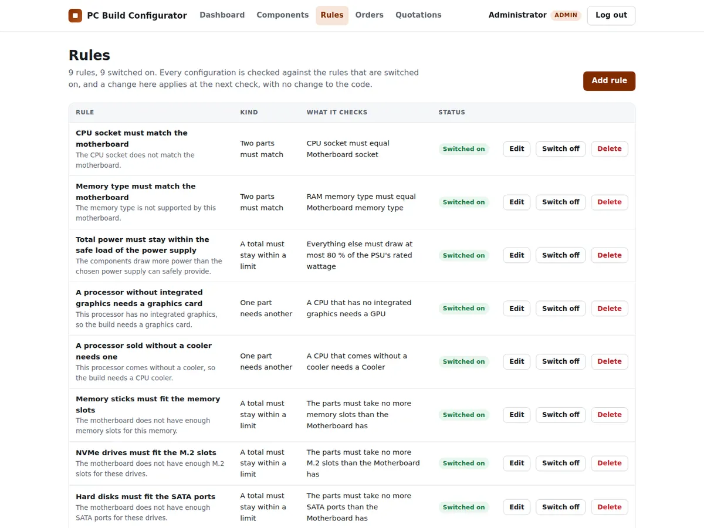

# PC Build Configurator and Inventory Management System

**Demo:** https://bravopacino.github.io/pc-build-configurator/ (the configurator only, running in your browser; see [The demo](#the-demo))

A web system for a shop that sells custom-built desktop PCs. Customers assemble
a configuration from the shop's components and the system checks, as they go,
that the parts work together: the processor fits the motherboard, the memory
suits it, and the power supply can carry the load. The checks are rules held in
the database, so the shop can add or change one without touching the code. A
configuration that passes can be ordered: its parts are reserved until the shop
approves the order, when they leave the stock, or rejects it with a remark. A
customer the configurator cannot serve asks the shop's consultant, who replies
on the request. The administrator's dashboard shows what needs attention, and
checks that every reserved quantity is accounted for by an order.

A course project, built solo with an AI assistant.
Plain HTML, CSS, JavaScript, PHP and MySQL. No framework.

| Each rule reports why it passes | The shop's rule list |
|---|---|
|  |  |

## The demo

GitHub Pages cannot run PHP or MySQL, so the demo is the configurator on its own:
choose a motherboard, then every other part is offered only if it fits, with the
reason under the ones that do not.

- `demo/index.html` is the configurator page as the PHP system renders it, saved once.
- `demo/data.json` holds the real categories, parts and compatibility rules,
  exported from the database by `demo/export.php`.
- `demo/engine.js` is a JavaScript copy of the rule engine in `includes/rules.php`.
  It answers the page's call to `api/check.php` in the browser, and the page's own
  `assets/js/configurator.js` runs unchanged.
- Checked against the PHP engine on 1,500 random builds, it gave the same answer
  every time: every verdict, every reason a part does not fit, and every total.

Accounts, saving, orders, stock and the admin pages need the full system below.

## Running it on XAMPP

Needs XAMPP with PHP 8.1 or newer.

1. Start **Apache** and **MySQL** in the XAMPP Control Panel.
2. Copy this folder into `C:\xampp\htdocs\` and name it `pcbuild`.
   Any name works; the links adapt to it.
3. Open <http://localhost/phpmyadmin>, choose **Import**, and import
   `sql/schema.sql`, then `sql/components.sql`. The first file creates the
   database itself. Importing it again deletes everything in the database and
   starts fresh.
4. Open <http://localhost/pcbuild/>.

Customers register themselves. The administrator account comes with the
database: **admin@pcbuild.local**, password **Admin@123**. Change that password
before the system is shown to anyone.

If MySQL has a password on your machine, put it in `DB_PASS` in
`includes/config.php`. Nothing else there needs changing.

If a page says the database is not running or has not been created, it also
says what to do: start MySQL, or import the two SQL files.

## Running it without XAMPP

PHP's own development server works for local use. From this folder:

    php -S 127.0.0.1:8080

Point it at a database elsewhere with the `DB_DSN`, `DB_USER` and `DB_PASS`
environment variables. The development server ignores the `.htaccess` files,
so keep it on your own machine.
